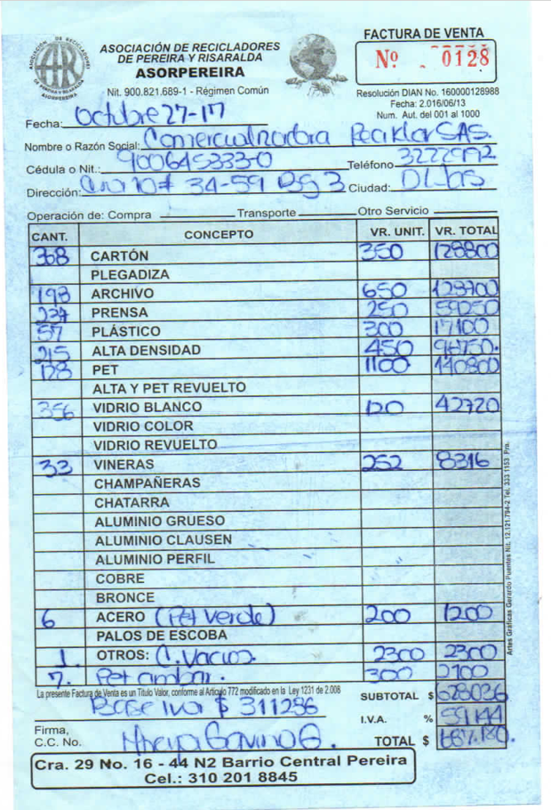

# modelo de la base de datos

La fuente principal de datos del sistema de información está en las facturas de
compra y venta, de donde se pueden deducir los informes comerciales y financieros.

## Facturas
Pueden ser de compra o de venta, segun el usuario al que se le hace la factura
(compra) o del que proviene la factura (venta) los costos unitarios de los
materiales pueden cambiar inclusive siendo cero si los materiales provienen de
los aforados (Instituciones - Donaciones)

``` javascript
{
    id: int,                  // codigo unico autoincremental
    fecha: Date(),
    eca: string,              // eca que emite o a la que le hacen la factura
    ciudad: string,
    tipo: "compra" | "venta",
    responsable: {
        id: int,              // Id de usuario registrado
        nombre,
        telefono
    },
    procedencia: string,      // del material (por ahora no se va a manejar)
    items: [
        {
            cantidad: float,
            concepto: string,      // tipo de material
            valorUnitario: float,
            total: float,
            iva: float
        }
    ]
    subtotal: float,           // suma de los totales sin iva
    iva: float,                // total del iva
    total: float,              // iva + subtotal

}
```
ejemplo de la factura que usan actualmente:



## Usuarios
Este documento contiene los usuarios registrados en la aplicación los cuales pueden
ser:

* recicladores con transporte de tracción humana. (se le compra material)
* recicladores con trasporte motorizado. (se le compra material)
* Aforados. (entidades donantes del material)
* mayorista comercializador. (se le vende material)
* mayorista industrial. (se le vende material)


``` javascript
{
    id: string,          // id unico, cedula o nit
    nombre: string,
    celular: int,
    direccion: string,
    asociado: boolean,
    tipo: string,       // reciclador | aforado | mayorista

}

```

NOTA: hay otro tipo de usuario que aun no se como tratar, y son los clientes de
la asociación o sea cada casa por donde pasa el reciclador y cada edificio que
entrega su material a los recicladores. estos clientes segun normativa tienen un
código único y la asociación debe tener registro de todos los clientes a los que
les presta el servicio, estos clientes creo que se pueden agrupar en zonas o rutas
y en la factura se puede ver reflejado en el campo procedencia (del material).
pero como a estos tipos de usuarios no se les compra directamente creo que podemos
ignorarlos por ahora mientras se aclaran otras cosas mas importantes relacionadas
a los usuarios que tienen una importancia superior en las facturas.

tambien es importante notar que estos usuarios no tienen nada que ver con los que
van a usar la aplicación.

## Precios
Como deacuerdo al tipo de usuarios existes precios diferentes para los materiales
se pronone una coleccion en donde cada documento defina los precios para un tipo
de usuario:

``` javascript
{
    tipoUsuario: string, //reciclador | aforado | mayorista. (campo único)
    precios: {
        carton: float,
        plegadiza: float,
        archivo: float,
        prensa: float,
        plastico: float,
        alta_densidad: float,
        pet: float,
        alta_y_pet_revuelto: float,
        vidrio_blanco: float,
        vidrio_color: float,
        vidrio_revuelto: float,
        vineras: float,
        champañeras: float,
        chatarra: float,
        aluminio_grueso: float,
        aluminio_clausem: float,
        aluminio_perfil: float,
        cobre: float,
        bronce: float,
        acero: float,
        palos_de_escoba: float
    }
}

```
